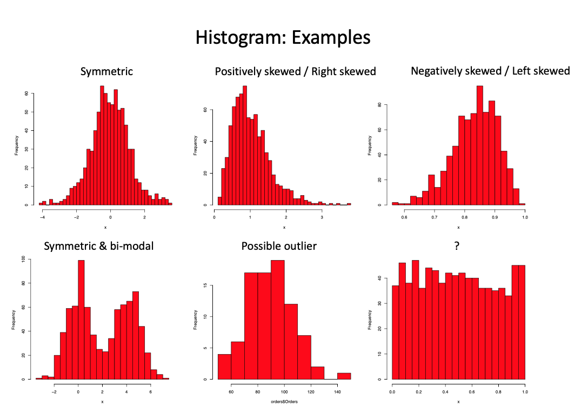
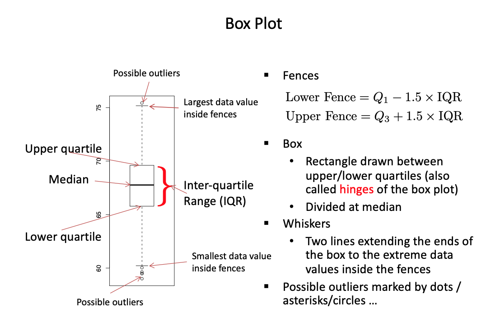

# STAT431: Statistical Inference

## Studies 

Experimental studies run by ***comparison***. There are two divisions: a test group and a control group. Ideally, the two groups are as similar as possible, as other confounding variables can be the cause of differences in results.
We can use large numbers with randomization to improve similarity. Controls should be given placebo and researchers and subjects should have a double-blind screen as to who is in which group.

Observational studies cannot assign treatment and control groups. Therefore, we can find correlated associations but not conclude because of confounding variables in between.
Ideally, we observe smaller groups controlled for particular factors as well to observe variations for said confounding variables. 

***Sampling*** selection of a subset of individuals from a population to estimate characteristics of the whole population.
Biases occurs if a sampled population does not reflect a population's interest (selection bias), subjects provide incorrect information (response bias) or particular subject do not respond (non-response bias) . 

A sample of n units is called a **simple random sample without replacement (SRSWOR)**. Enumerate all sets of nCn samples. Choose units with replacement from population, selecting new units until n distinct choices are made •Choose units without replacement from population

**Stratified Sampling** is when the population is divided into subgroups **(strata)**, and a simple random sample is selected from each one. This uses the law of large numbers to infer statistical foundations.

**Cluster Sampling** is when the population is divided into subgroups called **clusters**. Instead of sampling at random within each cluster, a random sample of clusters is selected and all units in each cluster are included in the sample, which is more representative. 

**Systematic Sampling** is when a population is ordered into a list, and the list is divided into consecutive segments of the same length. A random starting point is selected from the first segment, and the same point is sampled in each successive segment.

**Multistage sampling** is a combination of the above methods. For instance, the population could be stratified, then clusters could be chosen, and then systematic sampling could be performed within each cluster

## Summarizing Data

Data can be numerical or categorical. Numerical data can be discrete or continuous; categorical can be nominal or ordinal. For center and dispersion, we use means and standard deviations as statistical measures. However, these are sensitive to extreme values in data. 

Mean u = 1/n . sum[Xi]

Standard deviation s = root( 1/(n-1) . sum[(Xi-u)^2]

The median separates the higher and lower halfs in an ordered list of values - odd uses middle, even is the mean of the middle owo of the list. The xth quantile is defined as xsub(i/n+1) = xsubi. THe median and IQR are more robust! They are great for centers and dispersion but do not describe the shape of the empirical distribution or outlier values. 

Histograms are an alternative display with bins and frequency of events in said bins (intervals often approximated ot root(n)). Areas here are proportional to frequency.  

Box plots also demonstrate the spread of the data well and do mark outliers.

